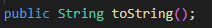
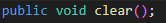
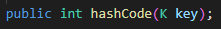
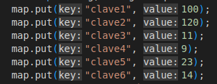
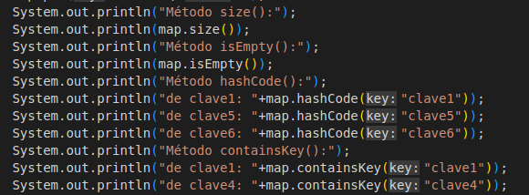
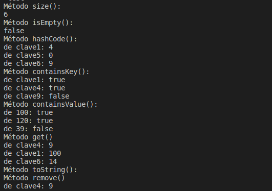
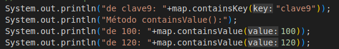
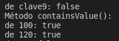
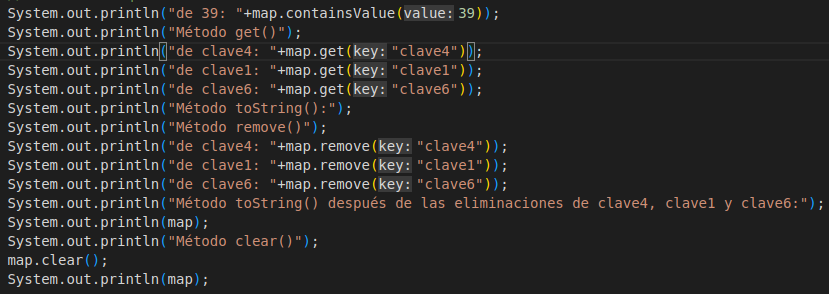
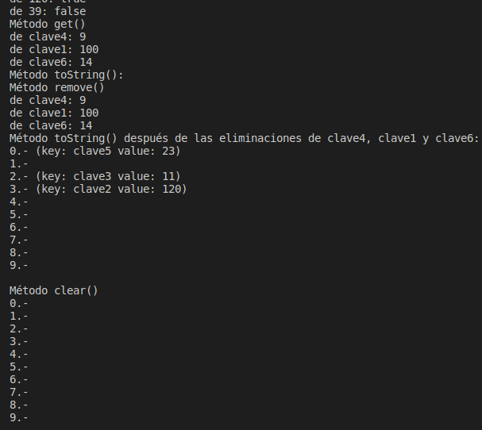

<table>
    <theader>
        <tr>
            <td></td>
            <th>
                UNIVERSIDAD NACIONAL DE SAN AGUSTIN 
                FACULTAD DE INGENIERÍA DE PRODUCCIÓN Y SERVICIOS 
                ESCUELA PROFESIONAL DE INGENIERÍA DE SISTEMAS
            </th>
            <td></td>
        </tr>
    </theader>
    <tbody>
        <tr><td colspan="3">Formato: Guía de Práctica de Laboratorio</td></tr>
        <tr><td>Aprobación:  2022/03/01</td><td>Código: GUIA-PRLD-001</td><td>Página: 1</td></tr>
    </tbody>
</table>

 <h3>INFORME DE LABORATORIO</h3>

<table>
 <theader>
  <tr><th colspan="6" bgcolor="red">INFORMACIÓN BÁSICA</th></tr>
 </theader>
 <tbody>
  <tr><td>ASIGNATUA:</td><td colspan="5">Estructura de Datos y Algoritmos</td></tr>
  <tr><td>TÍTULO DE LA PRACTICA:</td><td colspan="4">Hashing<td></tr>
  <tr><td>NÚMERO DE PRÁCTICA:</td><td>Practica de Laboratorio 07</td><td>AÑO LECTIVO:</td><td>2022 A</td><td>NRO. SEMESTRE:</td><td>III</td></tr>
  <tr><td>FECHA DE PRESENTACIÓN:</td><td>14-Agosto-2022</td><td>HORA DE PRESENTACIÓN:</td><td colspan="3">11:30 p.m.</td></tr>
  <tr><td>INTEGRANTES:</td><td colspan="3">-Diego Ivan Pacori Anccasi -Edson Joel López Quispe -Oliver Alessandro Mayta Nolasco -Edwin Francisco Aguilar Tancayo -Jordy Emanuel Ayma Cutipa</td><td>NOTA:</td><td>...</td></tr>
  <tr><td>DOCENTE:</td><td colspan="5">Richart Smith Escobedo Quispe - rescobedoq@unsa.edu.pe</td></tr>
 </tbody>
</table>
<table>
 <theader>
  <tr><th>SOLUCIÓN Y RESULTADOS</th></tr>
 </theader>
 <tbody>
  <tr><td><strong>I. SOLUCIÓN DE EJERCICIOS/PROBLEMAS:</strong> 
  <ul>
    <ol>
        <li>Deben contemplar como mínimo el desarrollo de todos los métodos en su clase
        </li>
        <h2>Método <em>ContainsKey</em></h2> 
        Este método verifica si contiene un elemento enlazado a la clave respondiendo verdadero o falso(valor booleano) según corresponda. Para lograr esto se apoyará del valor de la clave para lograr rápidamente este objetivo.
        <pre>public boolean containsKey(K key)</pre> 
        <h2>Método <em>ContainsValue</em></h2> 
        En este método se introduce un valor o elemento y  se tiene que recorrer toda la estructura hasta que un elemento coincida hasta que se encuentre un elemento igual al elemento ingresado, de manera similar que containsKey se retorna verdadero o falso si se encuentra un elemento igual al ingresado.
        <pre>public boolean containsValue(V value)</pre> 
        <h2>Método <em>Remove</em></h2>
        Este método recibe un parámetro, este parámetro es una variable genérica a la que se le llama K y retorna tambien una variable generica V. 
         
        Esta variable genérica pasa por el hashCode, para poder buscarlo en el ArrayList, si existe y verdaderamente es la clave que se busca (de lo contrario sigue al siguiente HashNode), lo remplaza por el siguiente en el ArrayList y se resta a la variable size, que almacena el número de elementos contenidos en el ArrayList.
        <pre>
        if(head.key.equals(key)){
            V val=head.value;
            head=head.next;
            bucket.set(index, head);
            size--;
            return val;
        }
        else{...}
        </pre>
        Terminando el método con la devolución del elemento eliminado.
        <h2>Método <em>ToString</em></h2>
        Este método recibe un parámetro, nos muestra fila por fila todos los elementos que estén en el HashMap en el siguiente formato: (Key: "llave" Value: "valor") 
         
        Lo que hace es que va pasa uno por uno cada elemento del arraylist y sobre cada elemento recorre la lista enlazada (siempre y cuando haya una elemento no NULO como siguiente nodo).
        <h2>Método <em>Clear</em></h2>
        Este método nos elimina cada elemento del HashMap. 
         
        Lo que hace es que elimina completamente todo el arrayList y posteriormente vuelve a inicializar todos los elementos en null, para posibilitar el volver a agregar elementos a nuestro hastMap VACÍO.
        <h2>Método <em>HashCode</em></h2>
        Este método nos retorna la clave de determinada "key". 
         
        Lo que hace es que utiliza el método hashCode() que tiene por defecto cualquier objeto(ya que hereda de "Object") y posteriormente le saca el módulo de la variable "numBuckets", que vendría a ser el número de filas del hashMap. Asi obteniendo el código hash.
        <li>Es posible agregar otros métodos que les ayuden a su resolución.            
        </li>
        <em>Considerando que los métodos usados en este laboratorio son los suficientes para la implementación del Hash no se ha considerado aumentar métodos.</em>
        <li>Crear un archivo de test donde incluyen casos de prueba.
        </li>
        Vista de la implementación del método put. 
         
        Vista de la los otros métodos. 
         
        Ejecución: 
        
        Claves que no estan en el Hash 
         
        Ejecución: 
         
        Implementación de un valor que no esta en el Hash 
         
        Ejecución: 
        
    </ol>
  </ul>

  <tr><td><strong>III. CONCLUSIONES:</strong>
   Una tabla hash tiene como principal ventaja que el acceso a los datos suele ser muy rápido, producto de la manipulación de las claves por ciertos algoritmos. Esta se implenta en tablas con indices producto de esa manipulación</td></tr>
 </tbody>
</table>

<table>
 <theader>
  <tr><td><strong>III. RETROALIMENTACIÓN GENERAL</strong> 
  </td><tr>
 </theader>
 <tbody>
  <tr><td>El hash o hashing es un método para convertir algún tipo de datos en un número
relativamente pequeño que puede servir como una "huella digital" de los datos. El
algoritmo hash manipula los datos para crear tales huellas digitales, llamadas valores
hash. Estos valores hash se utilizan generalmente como índices en tablas hash.
Lo que hace el hashing es tener un balance entre la cantidad de memoria a utilizar y las
restricciones del tiempo al realizar operaciones en los registros (consultas, inserciones,
eliminaciones, etc....). </td></tr>
 </tbody>
</table>

<table>
 <theader>
  <tr><td><strong>REFERENCIAS Y BIBLIOGRAFÍA</strong></td><tr>
 </theader>
 <tbody>
  <tr><td>https://www.delftstack.com/es/howto/java/hashmap-hashset-hashtable-in-java/#:~:text=%2C%201%3Done%7D-,Java%20HashSet,m%C3%A1s%20la%20interfaz%20de%20Colecciones.</td></tr>
  <tr><td>https://sites.google.com/a/espe.edu.ec/programacion-ii/home/tablas-hash</td></tr>
  <tr><td>https://es.wikipedia.org/wiki/HashCode()_(Java)#:~:text=En%20el%20lenguaje%20de%20programaci%C3%B3n,defecto%2C%20por%20la%20clase%20Object.</td></tr>
 </tbody>
</table>
